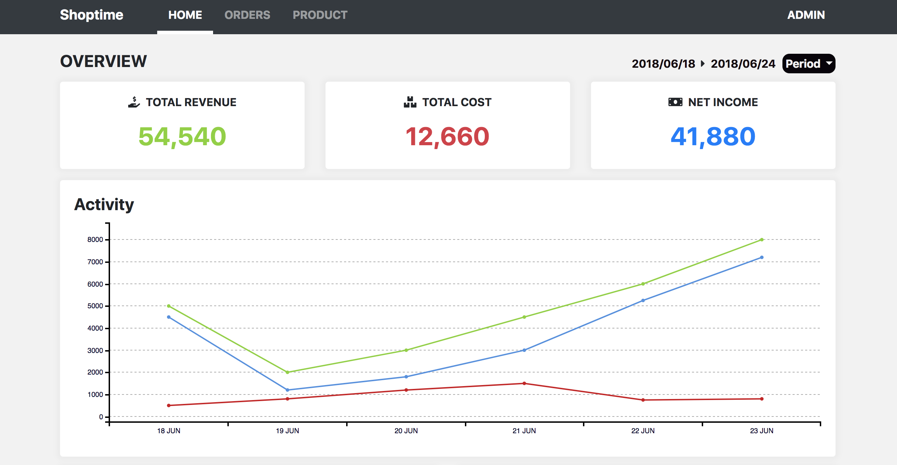

# Order Administration System Interface 

## Introduction

This application shows the UI of order administration system. The main content separates into three parts, including
home page, orders page, product page. In the home page, there is one division for the chart display and some latest 
order news. In the order page, we can control all the order status. In the third page, it presents all the product of 
our company, and we can also add any new product into list.

## Screenshot

 

## Demo

Check it out [live](https://trnet4334.github.io/Order-Admin-System/)!

## Technologies
   
This page was built by using the following technologies: 

* Html
* CSS (Bootstrap 4)
* JavaScript ES6
* JQuery
* c3.js

## Task list

- \[x] Page layout
- \[x] Styling form block
- \[ ] Make whole page responsive
- \[ ] Use faker.js to randomly present user data on the interface
- \[ ] Order control function
- \[ ] Product adding function